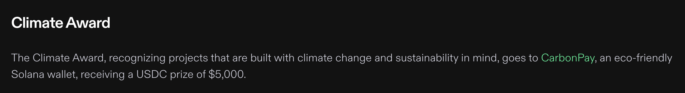

# CarbonPay

## HyperDrive Climate Award Winner

CarbonPay is Solana's first carbon-negative crypto wallet. It aims to mitigate transaction carbon footprint by employing eco-friendly practices and investing in carbon offset initiatives, contributing to a sustainable and environmentally conscious approach to digital finance

## What's Broken?

- 80% of ReFi protocols don't have good marketing and lack users.
- Consumer focused offsetting can offset emissions 50 times faster than only business focused offsets.
- Crypto can only become mainstream if there is enough positive impact

## How CarbonPay solves it.

- Unified tooling:We're building a platform where every wallet can use or SDK to help create positive impact.
- Helping protocols onboard users, CarbonPay integrates Dapps to easily allow them to transact and increase traffic to other Dapps from a single platform.
- Incentivize offseting, we incentivize offsets with NFTs and real world impact such as planting trees.

## Tech Stack

**App:** React-Native

**Contracts:** Rust

## Screenshots

<table>
  <tr>
    <td align="center">
      
    </td>
    <td align="center">
      
    </td>
    <td align="center">
      
    </td>
  </tr>
  <tr>
    <td align="center">
      
    </td>
    <td align="center">
      
    </td>
    <td align="center">
      
    </td>
  </tr>
</table>

## Installation

Install dependencies

`yarn install` or `npm install`

Launch the app on your Android device/emulator

`npx react-native run-android`

## Authors

- [@sameer kashyap](https://www.github.com/Sameerkash)
- [@sahil kakwani](https://www.github.com/Sahilkakwani9)

## Demo

- [Link to Demo](https://youtu.be/sKg_gE3anjE?si=8pd-LOn5424TSVkE)
